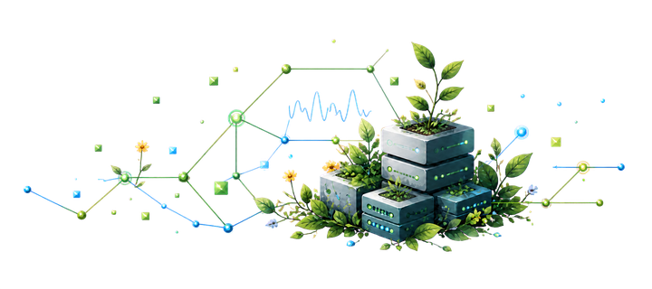

<table>
  <tr>
    <td width="58%" valign="middle">
      <h1>Hi, I'm ccsert.</h1>
      <h3>Turning complex engineering work into tools people can actually use.</h3>
      
Developer tools · AI-assisted engineering · self-hosted infrastructure

      

        
        
        
        
      

    </td>
    <td width="42%" valign="middle" align="center">
      
    </td>
  </tr>
</table>

 

## Selected systems

<table>
  <tr>
    <td width="58" align="center" valign="top">
      
    </td>
    <td valign="top">
      <h3><a href="https://github.com/ccsert/opencode-review-gitea">OpenCode Gitea Review</a></h3>
      
<strong>AI review, inside the forge.</strong> Structured pull-request reviews for Gitea and Forgejo, running where the code already lives through native Actions workflows.

    </td>
    <td width="245" valign="middle">
      
      
      
      
    </td>
  </tr>
  <tr>
    <td width="58" align="center" valign="top">
      
    </td>
    <td valign="top">
      <h3><a href="https://github.com/ccsert/artifact-gateway">Artifact Gateway</a></h3>
      
<strong>One control plane. Native protocols. Verified bytes.</strong> A lightweight artifact repository built around PostgreSQL coordination, S3-compatible storage, and the package-manager protocols developers already use.

    </td>
    <td width="245" valign="middle">
      
      
      
      
    </td>
  </tr>
  <tr>
    <td width="58" align="center" valign="top">
      
    </td>
    <td valign="top">
      <h3><a href="https://github.com/ccsert/DocBabel">DocBabel</a></h3>
      
<strong>Serious PDF translation, without giving up your data.</strong> A self-hosted workspace for translation queues, glossaries, model configuration, offline assets, and administration.

    </td>
    <td width="245" valign="middle">
      
      
      
      
    </td>
  </tr>
  <tr>
    <td width="58" align="center" valign="top">
      
    </td>
    <td valign="top">
      <h3><a href="https://github.com/ccsert/omz-pm">omz-pm</a></h3>
      
<strong>Oh My Zsh, made discoverable.</strong> A safe Rust terminal interface for exploring and managing plugins and themes, with a complete 359-entry Chinese guide and preview-before-write workflow.

    </td>
    <td width="245" valign="middle">
      
      
      
      
    </td>
  </tr>
</table>

 

## The through-line

The projects look different, but the standard is the same: keep the operational
surface small, integrate at the native protocol boundary, make state visible,
and never confuse a successful build with a verified release.

  
  
  
  

 

  CORE TOOLBOX
    
  <picture>
    <source media="(prefers-color-scheme: dark)" srcset="https://skillicons.dev/icons?i=go,rust,ts,py,react,docker,postgres,kubernetes,linux&theme=dark" />
    <source media="(prefers-color-scheme: light)" srcset="https://skillicons.dev/icons?i=go,rust,ts,py,react,docker,postgres,kubernetes,linux&theme=light" />
    
  </picture>

